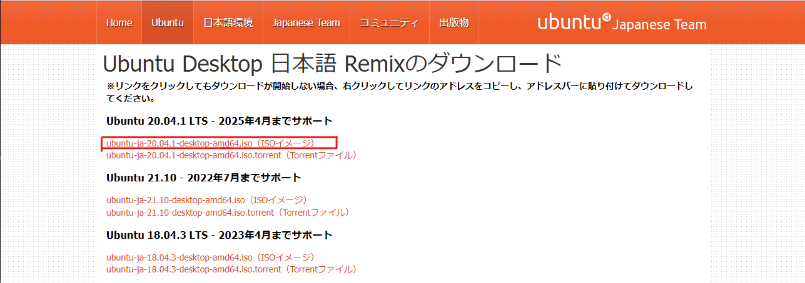
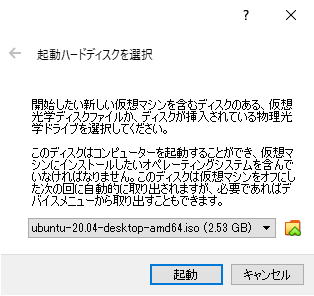

# VirtualBoxを用いてubuntu環境を作成する  
### ①VirtualBoxのインストール  
- WEBブラウザで以下のURLにアクセス。  
<https://www.virtualbox.org>  

- 中央の[Download...]ボタンを押下。  
    

- [VirtualBox (最新ver) platform packages]-[Windows hosts]リンクを押下。   
  

- ダウンロードしたVirtualBox-(最新ver)-******-Win.exeを実行してインストールを完了させる。  
  インストール中の選択肢は基本的にNextやYesを選択。  
    
- インストールの途中で、以下のようなダイアログが表示された場合は、  
  ["Oracle Corporation"からのソフトウェアを常に信頼する(A)]をチェックし、  
  [インストール(I)]ボタンを押下。  
    

- インストール完了後、VirtualBoxを起動。  
  その後、以下のようなダイアログが出る場合は  
  ログ内のリンクから最新バージョンをインストールする。  
    

### ②Ubuntuのインストール  
- WEBブラウザで以下のURLにアクセス。  
<https://www.ubuntulinux.jp>  

- [日本語 Remix イメージのダウンロード]をクリック。  
    

- [ubuntu-ja-18.04.3-desktop-amd64.iso（ISO イメージ)]をクリックしてダウンロードを開始する。  
    

- 既にインストール済みのVirtualBoxを起動し、[新規(N)]ボタンを押下。  
    

- [名前:]にUbuntuを入力。(※Ubuntuであることが分かる名前であれば良い)  
  [マシンフォルダ:]に任意の存在するフォルダを指定。  
  (名前にUbuntuを入力すると、[タイプ(T):]Linux、[バージョン(V):]Ubuntu(64-bit)が自動選択)  
  [次へ(N)]ボタンを押下。  
    

- 任意のメモリサイズを指定  
  ※PCが持つメモリサイズの半分以下にしておくこと。  
    (メモリサイズが4GBのときは、1024MB程度しか割り振れない)  
  [次へ(N)]ボタンを押下。  
    

- [仮想ハードディスクを作成する(C)]を選択。  
  [作成]ボタンを押下。  
    

- [VDI(VirtualBox Disk Image)]を選択。  
  [次へ(N)]ボタンを押下。  
    

- [可変サイズ(D)]を選択。   
  [次へ(N)]ボタンを押下。  
    

- ファイル名は変更しない。  
  ディスクサイズに任意のサイズを指定。(Cドライブの容量を考慮した上で設定)  
  [作成]ボタンを押下することで仮想マシンの作成が完了。  
    

- 作成した仮想マシンを選択し、[起動(T)]ボタンを押下。  
    

- [起動ハードディスクを選択]画面で、プルダウンリストの右側にある[ファイル選択]アイコンを押下。  
    

- 上部の[追加(A)]アイコンを押下し、事前にダウンロードしたUbuntuインストールファイルを開く。  　
    

- Ubuntuファイルを選択し、[起動]ボタンを押下。    
    

- 2～5分程度で以下の画面が表示されるので、[Ubuntuをインストール]ボタンを押下。  
    

- キーボードレイアウトは、2箇所とも[日本語(Japanese)]が選択されていることを確認し、[続ける]ボタンを押下。  
    

- [通常のインストール]と[Ubuntuのインストール中にアップデートをダウンロードする]にチェックが入っている事を確認し、[続ける]ボタンを押下。  
    

- [ディスクを削除してUbuntuをインストール]を選択し、[インストール]ボタンを押下。  
  直後、[ディスクに変更を書き込みますか？]の確認ダイアログが表示されたら、[続ける]ボタンを押下。  
    

- [どこに住んでいますか？]が表示されたら、[Tokyo]を入力し、[続ける]ボタンを押下。  
    

- [あなたの情報を入力してください]が表示されたら、  
  [あなたの名前:][コンピュータの名前:][ユーザの名前:]に任意の名前を入力、  
  [パスワードの入力:][パスワードの確認:]に同じパスワードを入力、  
  [ログイン時にパスワードを要求する]を選択し、[続ける]ボタンを押下。  
    

- インストールが始まる。(機器の性能やネットワークの状況によるが、10分～30分程度かかる。)  
  インストールが終了し、以下の画面が表示されたら[今すぐ再起動する]ボタンを押下。  
    

### ③Ubuntu初期設定  
- 再起動後、以下の画面が表示されるので[Enter]キーを入力。  
    

- しばらくするとインストール時に作成したユーザが表示されるので、クリック。  
  インストール時に指定したパスワードを入力し[Enter]キーを入力。  
    

- [オンラインアカウントへの接続]画面が出た場合は、[スキップ(S)]ボタンを押下。  
    

- [Livepatch]画面が出た場合は、[次へ(N)]ボタンを押下。  
    

- [Ubuntuの改善を支援する]画面で、[この情報を送信しますか？]は、どちらか任意の方を選択し、[次へ(N)]ボタンを押下。  
    

- [プライバシー]画面で、[位置情報サービス]をOFFにして、[次へ(N)]ボタンを押下。  
    

- [準備が完了しました!]画面で、[完了(D)]ボタンを押下。  
    

- [ソフトウェアの更新]ダイアログが表示されたら、[今すぐインストールする]ボタンを押下。  
  その後、[認証が必要です]ダイアログが表示されたら、パスワードを入力し[認証]ボタンを押下。  
    

- ソフトウェアの更新が完了すると、[ソフトウェアの更新]ダイアログが表示される。  
  [すぐに再起動(R)]ボタンを押下する。  
    

- インストールが完了したら、インストール直後の状態のスナップショットを取得しておく。  
  VirtualBoxのメニューバー[仮想マシン]-[スナップショット作成]を選択。  
  [スナップショットの名前(N)][スナップショットの説明(D)]に任意の⽂字列を⼊⼒し、 [OK]ボタンを押下   
    

### ④Ubuntuインストール後にやること  
#### 最新版へのUpdate  
- [アクティビティ]-[アプリケーションを表示する]を選択し[端末]を起動。  
  コマンドプロンプトの画面が出てくるので、以下のコマンドを実行。  
  `sudo apt update`  
  `sudo apt upgrade`    
  (途中、確認プロンプトが表示された場合はyを入力し、[Enter]を押下。)  
    

#### 画面サイズの変更  
- VirtualBoxのメニュー-[デバイス]-[Guest Additions CDイメージの挿入]を選択。   
  直後、["VBox_GAs_6.1.6"には...]という確認ダイアログが表示されたら[実行(R)]ボタンを押下。  
  認証ダイアログが表示されたら、パスワードを入力し[認証]ボタンを押下。  
  するとコマンドプロンプトが出現し、インストールが開始される。  
  インストールが終わると[Press Return to close this window...]と表示されるので、[Enter]キーを押下。  
    

- インストールが完了したら、右上の[電池のアイコン]を押下、[電源オフ...]を選択。  
  [再起動]ボタンを押下する。  
    

#### WindowsとUbuntuでのファイルの共有  
- VirtualBoxのメニュー-[デバイス]-[共有フォルダ]-[共有フォルダ設定...]を選択。  
    

- 右端の[新規共有フォルダを追加します。]アイコンボタンを押下。  
    

- [フォルダのパス:]にWindowsのフォルダを指定。(例[C:\Dev])  
  ([フォルダ名]は、自動で入力される。)  
  [マウントポイント:]にUbuntu側のディレクトリを指定。(例[/mnt/dev])  
  [自動マウント(A)][永続化する(M)]をチェックし、[OK]ボタンを押下。  
    