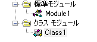

# リファレンス

## 概要



- VBAには下記のモジュールがあります。
  - 標準モジュール → プロシージャ群（関数の集まり）
  - ブックモジュール → ブック内に一つだけ持てるモジュール
  - シートモジュール → シートと一対一の関係のモジュール
  - クラスモジュール → 読んでそのままのクラスモジュール

- UDF( User Defined Function ) → プロシージャはセルから独自関数として読み込むことができる。
  - ※ただしプロパティによっては使えないモノも存在する。

## 基本文法

### コメント

```vba
'コメント文
```

### 型一覧

|型名|型指定子|内容|
|----|----|----|
|ブール型| Boolean|TrueまたはFalse|
|バイト型| Byte|0～255までの整数|
|整数型| Integer|32,768～32,767の整数|
|長整数型| Long|2,147,483,648～2,147,483,647の整数|
|通貨型| Currency|922,337,203,685,477.5808 ～ 922,337,203,685,477.5807の固定小数点数|
|単精度浮動小数点数型| Single|負の値：約-3.4×10(38乗)～-1.4×10(-45乗)正の値：約1.4×10(-45乗)～1.8×10(38乗)|
|倍精度浮動小数点数型| Double|負の値：約-1.8×10(308乗)～-4.0×10(-324乗)正の値：約4.9×10(-324乗)～1.8×10(308乗)|
|日付型| Date|日付：西暦100年1月1日～西暦9999年12月31日時刻：0:00:00 ～ 23:59:59|
|文字列型| String|任意の長さの文字列
|オブジェクト型| Object|オブジェクト|
|バリアント型| Variant|すべてのデータ|

### 変数宣言

```vb
Dim 変数名 As Long
変数名 = 10 / 4
```

### 変数宣言（オブジェクト）

- オブジェクト型で宣言したオブジェクト変数に、オブジェクトを格納するときは、Setを使わなければなりません。

```vb
Dim ws As Worksheet
set ws = Sheets("Sheet1")
```

### プロシージャ

```vb
Sub プロシージャ名()
    Range("A1").Value = 10
    Range("A2").Value = 20
    Range("A3").Value = 30
End Sub
```

```vb
Function プロシージャ名() As 戻り値の型
    Range("A1").Value = 10
    Range("A2").Value = 20
    Range("A3").Value = 30

    プロシージャ名 = 戻り値の型
End Function
```

### プロパティ

- 「オブジェクト名.プロパティ名」でプロパティを取得できる。

```vb
Range("A1").Value
```

### withステートメント

- オブジェクト名の記述を省略できる書き方

```vb
With Selection.Interior
    .Pattern = xlSolid
    .PatternColorIndex = xlAutomatic
    .Color = 255
    .TintAndShade = 0
    .PatternTintAndShade = 0
End With
```

### 条件文

```vb
If isA Then
    MsgBox foo
ElseIf isB
    MsgBox bar
Else
    MsgBox baz
End If
```

### 繰り返し文

```vb
For i = 0 To 10
    ~~~
    If isA Then
        Exit For
    End If
Next i
```

```vb

Dim r As Range
For Each r In Worksheets("Sheet1").Range("A20:D40")
    If Abs(c.Value) < 0.01 Then c.Value = 0
Next

```

## 参考

---

### 基礎

- OfficeVBAリファレンス（公式サイト） - <https://docs.microsoft.com/ja-jp/office/vba/api/overview/>
- チートシート - <https://qiita.com/uchiko/items/3d7a5ef3e2676c961ee2>
- チートシート２ - <https://qiita.com/4door/items/7808489e0c69a2e58a5d>
- VBA基礎文法最速マスター - <http://d.hatena.ne.jp/nattou_curry_2/20100129/1264787849>
- VBA型 - <http://officetanaka.net/excel/vba/variable/03.htm>

---

### テクニック

- VBA高速化テクニック - <http://officetanaka.net/excel/vba/speed/>

- 例外処理 - <https://qiita.com/fuk101/items/aa12f4934e5cc3eba296>

- 独自ログ
  - ログ出力 - <https://excel-vba.work/2020/11/02/%E3%80%90vba%E3%80%91%E3%80%90%E5%AE%8C%E5%85%A8%E7%89%88%E3%80%91%E3%83%AD%E3%82%B0%E3%82%92%E5%87%BA%E5%8A%9B%E3%81%99%E3%82%8B/>
  - ログ出力2（結構いい） - <https://nandakagoodvibes.hatenablog.com/entry/2020/11/02/004046>

- 誰かが作ったVBAのtool - <https://github.com/VBA-tools>
- ログ管理 - <https://vba-labo.rs-techdev.com/archives/1662>

- VBAのコールバック方法 - <https://qiita.com/Kamo123/items/e676e0cbe6de83410980>

---

### その他

- Excelマクロ（VBA）をVSCodeで編集したい - <https://kanegolabo.com/vba-edit>
- Excelマクロをvscodeで書きたいんよね。 - <https://zenn.dev/hirony/articles/253e9d88642d16>