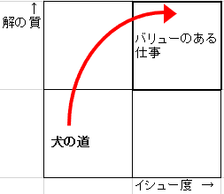

# イシューからはじめよ　レポート
## 1章

### 読んで学んだこと  
#### ①「犬の道」に入らないようにするには？  
   
やるべきはイシューを「見極める」こと。  
イシューを見極めるというのは、考えたイシューに対して「何に対して答えを出すものなのか、何のためにやるのか」を明確にすること。  
やっている内に答えを出そうとする、またはやらなくても分かると言ってこのイシューの見極めを飛ばすのはNG。  

先に答えを明確にしておかないと、後から混乱することになる。  
一人で活動する時でも、チーム単位で活動するときも同様。  

例）「仕事を効率よくしたい」 ...効率よくするには何をしたらいい？  
    「相手に分かりやすい資料を作る」 ...相手に分かりやすく伝える為にはどうすればいい？  

#### ②イシューを見極めるには何をすれば良い？  
以下の観点で判断する。  
- 受け手にとって、実際にインパクトがある内容か？  
- 説得力ある形で検証できるか？  
- 想定する受け手に内容を伝えられるか？  
こうした見極めは一人でやるよりも、上司といった相談相手に確認してもらった方が効率が良い。  

見極めるためには、まずイシューに対して具体的な「仮説」を立てる必要がある。  
仮説を立てる理由は以下の3つ。  
- イシューに答えを出すため。  
  - 「○○はどうなっているか？」ではなく「○○はこうなるのでないか？」という仮説を立てる。  
- 必要な情報・分析すべきことが、仮説を立てることではじめて理解できるから。  
- 分析結果の解釈が明確になるから。  
  - 出てきた結果が十分なのか、そうでないのかを判断するために仮説が必要となる。  

仮説を立てる事が出来たら、次にその仮説の内容を言葉(メモ帳や電子ファイル等の媒体)に起こす。  
→自分や相手に誤解を発生させないために必要な行為。  

例）「○○をしたら、仕事が効率よく進めれるのでないか？」  
    「○○を実現するためには、●●をしたらいいのではないか？」  

#### ③イシューと仮説を言葉で説明する時の注意点  
イシューを言葉で説明した時に詰まってしまう → イシューの見極めと仮説の立て方が甘いのが原因。 
以下は、言葉で説明するときに気をつけるべき箇所である。 
- 主語と動詞を入れる。  
- 「WHY(何故か？)」よりも、「WHERE(どこを目指すべきか)」「WHAT(何を行うべきか)」「HOW(どう行うべきか)」を考える。  
- 文章中に比較表現(○○するのはAの方法ではなくて、むしろBの方法)を入れるという方法  
  - 対比させることで、何に対して答えを出そうとしているのかが明確になる。  

例）WHERE = 資料作成にかける時間の短縮  
    WHAT = 必要な情報だけを洗い出せるようにする  
    HOW =  ヒアリング回数を増やす  

#### ④「よいイシュー」の条件とは？  
よいイシュー → 自分やチームを奮い立たせ、検証された暁には受け手をうならせるもの  
よいイシューには以下の共通点がある。  
- 本質的な選択肢であること  
  - 「本質的な選択肢」 ...その選択肢によって結果が大きく変わるもの。  
  - 今答えを出すべきでない「なんちゃってイシュー」を作らないように気をつけること。  
- 深い仮説がある  
  - 既存の常識を否定する、もしくは全く異なる視点(=新しい構造)で説明できる仮説のこと。  
  - 「新しい構造」  
    - 共通性の発見 ...2つ以上のものに、何らかの共通することを見出す  
    - 関係性の発見 ...全体像が分からなくても、複数の現象間に関係があると分かれば全体が理解できる。  
    - グルーピングの発見 ...検討対象を何らかのグループに分ける方法を発見する。  
    - ルールの発見 ...2つ以上のものに、何らかの仕組みや法則を見出す  
- 答えを出せる  
  - 例え本質的な選択肢を含んでいて且つ、深い仮説を持ったイシューであっても  
   明確な答えを出せるものでなければ「よいイシュー」とは言えない。  
-  既存の手法、またはこれから着手するやり方で本当に答えを出せるのか考える必要がある。  

例）立てたイシューに対して「既存のやり方が上手く出来てない」or「既存のやり方だけでは足りない」？  

#### ⑤イシューや仮説を導き出す為の情報収集  
イシューやそれに対する仮説を導き出すには、取り組むテーマや対象について考える為の材料を得る必要がある。  
重要な点は以下の3つ。  
- 一次情報に触れる  
  - 「一次情報」 ...誰のフィルターも通ってない情報。現場の声や、加工されてないデータのこと  
- 基本情報をスキャンする  
  - 決め打ちをせず、世の中の常識・基本的な事(知ってないといけない数値、業界の知識など)をスキャンする(=調べる)  
  - 「これを知ってないとその分野の人との会話が成り立たない」ということを、雑誌の特集記事や書籍などを使ってカバーする。  
- 集めすぎない・知りすぎない  
  - 情報を集めすぎると、自分ならではの視点で考えるのが難しくなる。  
    意図的にざっくり調べる = 「やりすぎない」事が大切。  

#### ⑥イシューを引き出すための知恵が足りない場合は？  
- 変数を削る(関連する要素が多すぎる場合は削って、何が決め手なのかを明確にする)  
- 視覚化する(絵やグラフを活用する)  
- 最終系から辿る(「最終的に相手が欲しいものは何か」から、逆算的に考える)  
- 「So What(だから何？)」という質問を自分やチーム内に繰り返す  
- 極端な事例を考える(○○が何倍だったら、何十分の一だったら？)  
- イシューを解ける形で設定し直せないかを考える  
- 「そのイシューは答えがでない」として、他に本質的なイシューがないかを探す  

### まとめ  
- 「イシューを見極める」というのは、つまり「今本当に答えを出すべき問題」を見つけるということ。  
- イシューの中身に対して仮説を立てることで、そのイシューがどのくらい重要なのかを見極めることができる。  

### 読んだ感想・見解  
- 序章の内容と比べて理解するのに時間がかかったが、内容は理解できた  
- 「やっていく内に答えを出す」のではなく、「やる前から答えを明らかにする」のが大事だと分かった。  
