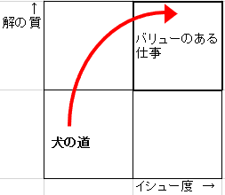
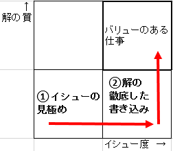

# イシューからはじめよ　レポート
## 序章

### 読んで学んだこと
#### ①バリューのある仕事(意味のある仕事)とは何か？
- 質の高い仕事？ → 「バリュー」を「質」に言い換えてるだけ  
- 丁寧な仕事？ → 全ての仕事にバリューがあるとは限らない  
- 他の誰にもできない仕事？ → 価値が無いからこそ誰もやっていない  

→バリューの本質は、「**イシュー度**」と「**解の質**」の二つの軸で成り立っている。  
  

#### ②どう進めていけば良いのか？
まずは「イシュー度」を上げることに取り組み、その後に「解の質」を上げると良い。  
解の質から上げていくのは悪いやり方なので注意すること。（＝**犬の道**）  
**《キーワード》**  
「イシュー」 ...色々な定義があるが、簡単に言うと「課題」という意味  
「イシュー度」 ...バリューの本質の図における横軸。問題に対して答えを出す必要性の高さを示す。  
「解の質」 ...バリューの本質の図における縦軸。イシューに対してどこまで明確に答えを出せているかの度合いを示す。  
「犬の道」 ...大量の仕事や労働量を重ねることで解の質を上げようとするやり方  

#### ③「犬の道」を歩んではいけない理由とは？
- イシュー度の低い問題（重要性の低い問題）に対して必死に取り組んでも意味がないから。  
- 仮に犬の道を通って成長した場合、このやり方でしか部下に仕事を教える事ができなくなってしまうから。  

努力と根性で何とかする考え方では生産性は上がらない。  
大事なのは同じ労力・時間で多くの「**価値のあるアウトプット**」を生み出すこと。  
残業や徹夜、休日出勤で一生懸命さをアピールしても、アウトプットの質が低ければ意味がない。  

#### ④「イシュー度」と「解の質」を上げるにはどうすれば良いのか？
イシュー度を上げるには、まず問題を絞り込むことからはじめる。  
核となる問題を絞るのが難しい場合でも、10分の1くらいまで絞り込む事なら出来るはず。  
絞り込みの判断が難しいなら、思いついた問題の中で本当に価値のあるものはどれか、上司に聞いてみよう。  

絞り込めたら、その中の「イシュー度」の高い問題から手を付ける。   
解きやすさ、取り組みやすさで考えず、イシュー度の高さで判断すること。  
その個々のイシューに対して十分な検討・分析時間を確保することが、「解の質」を上げることに繋がる。  
  

#### ⑤バリューのある仕事を生み出すプロセスについて
月曜～金曜の範囲で考えた場合  
- 月曜：今本当に答えを出すべき問題＝「イシュー」を見極める（第一章の内容）  
- 火曜：イシューを解けるところまで小さく砕き、それに基づいてストーリーの流れを整理する（第二章の内容）  
        ストーリーを検証するために必要なアウトプットのイメージを描き、分析を設計する（第三章の内容）
- 水・木曜：ストーリーの骨格を踏まえつつ、段取りよく検証する（第四章の内容）  
- 金曜：論拠と構造を磨きつつ、報告書や論文をまとめる（第五章の内容)  

上記のサイクルを一回しするだけで終わらせず、素早く回して何回転もさせることが生産性を高める鍵となる。  

#### 余談（本書籍内のコラムに書かれていたこと）
情報を噛み締める ...表層的な思考、考えたフリをせずに、様々な意味合いや価値を理解できる人であるべき。  

### まとめ
大事なのは以下の手順。  
1. 「イシュー」の見極め（イシュー度が高いものはどれか）  
2. 「解」の徹底した書き込み（十分な時間を設けて取り組む）  

### 読んだ感想・見解
- 生産性を上げる為にやる事、意味のある仕事の進め方について学ぶことができた。  
- 今まではとにかく時間をかければいいと思っていたので、新しい考え方を知るという新鮮な体験ができた。  
- イシューの見極め方、意味のある仕事の手順はこれから学んでいくので、読み込んでより一層深く理解する。 
