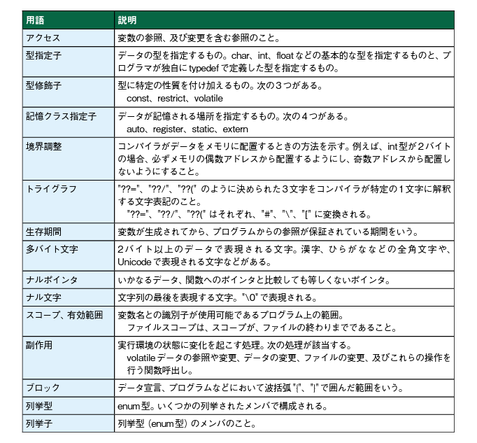
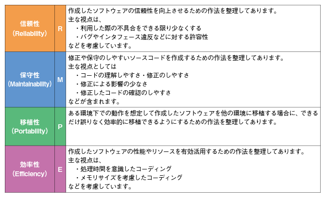

# 組み込みプログラムについて

- 「組込みソフトウェア開発向けコーディング作法ガイド［C言語版］ESCR」- <https://www.ipa.go.jp/sec/reports/20180215.html>
  - 改訂版  組込みソフトウェア開発向け コーディング作法ガイド［C言語版］ESCR Ver.3.0 - <https://www.ipa.go.jp/files/000064005.pdf>
  - ESCR C・C++/MISRA C・C++/CERT C・C++/CWE 対応表 PDF文書 - <https://www.ipa.go.jp/files/000065350.pdf>

- 用語
- 
- JIS X 25010 日本産業規格のソフトウェア品質に関する4つの特性 
- 
- システム及びソフトウェア製品の品質要求及び評価（ＳＱｕａＲＥ）－システム及びソフトウェア品質モデル - <https://www.jisc.go.jp/app/jis/general/GnrJISNumberNameSearchList?toGnrJISStandardDetailList>
  - 閲覧するためには、JISCのユーザ登録が必要です。
